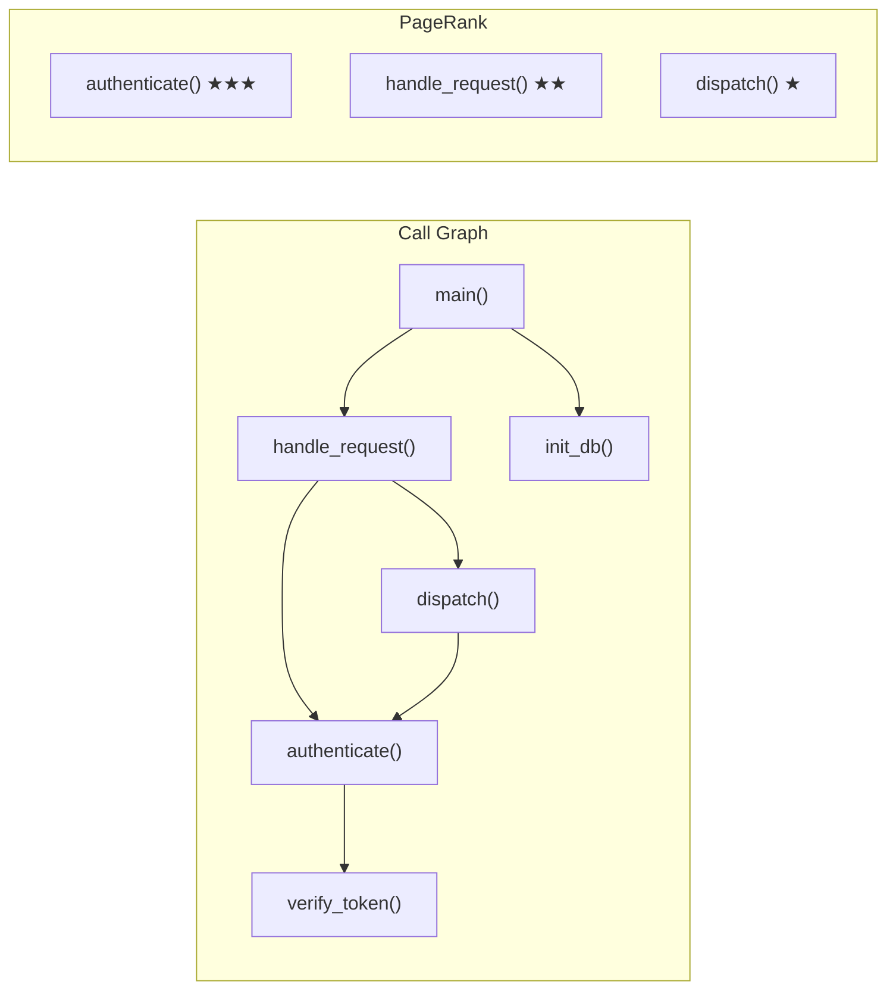
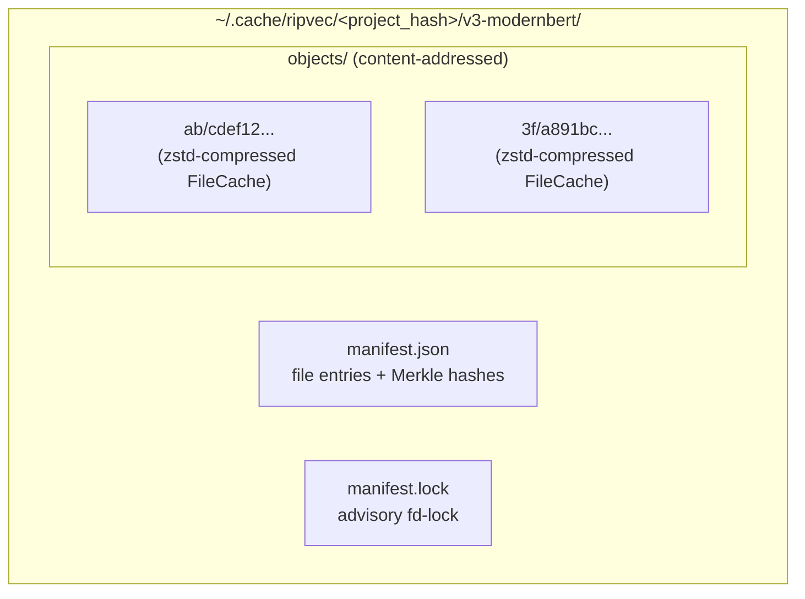
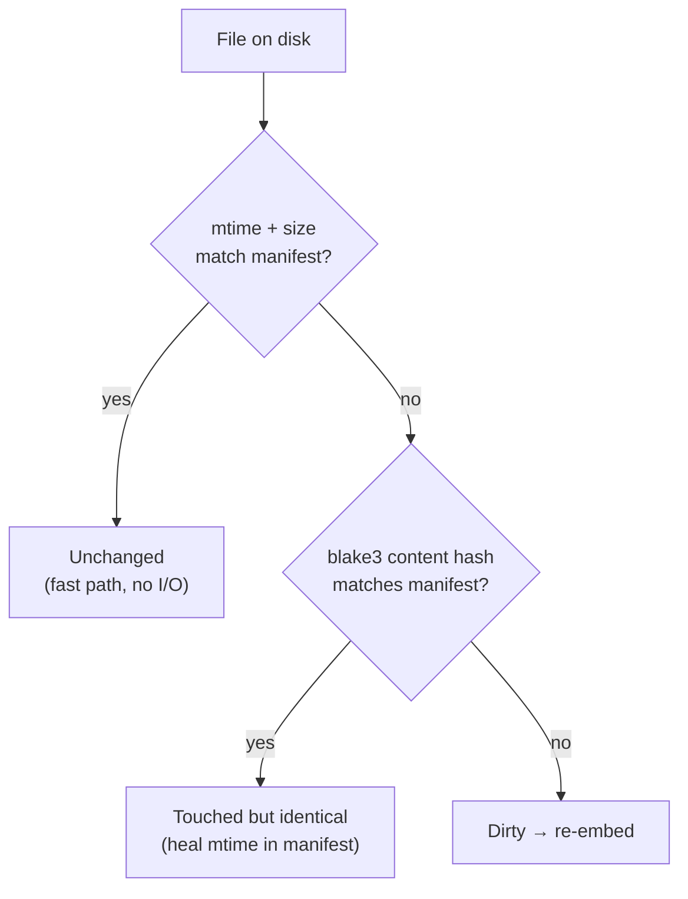
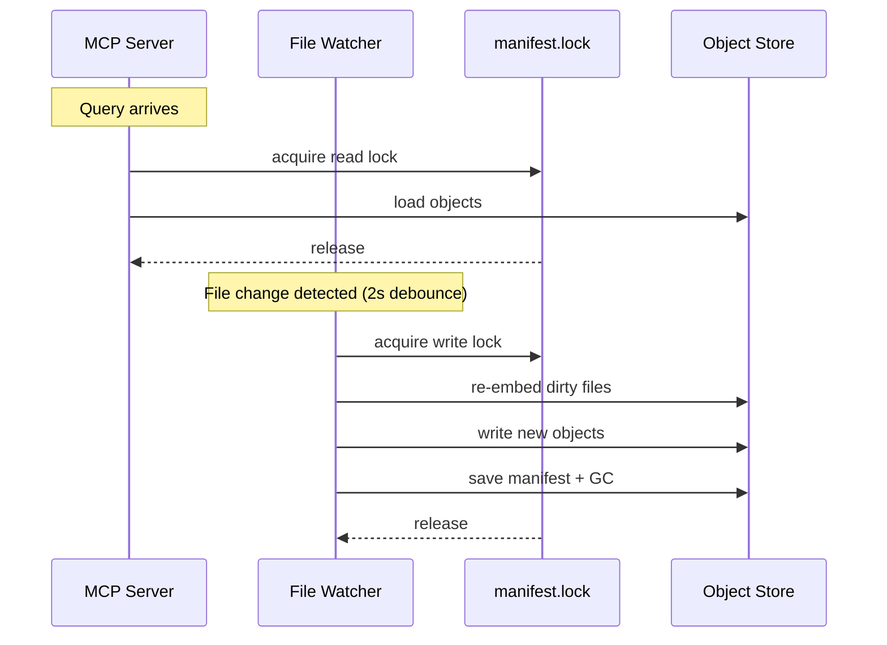
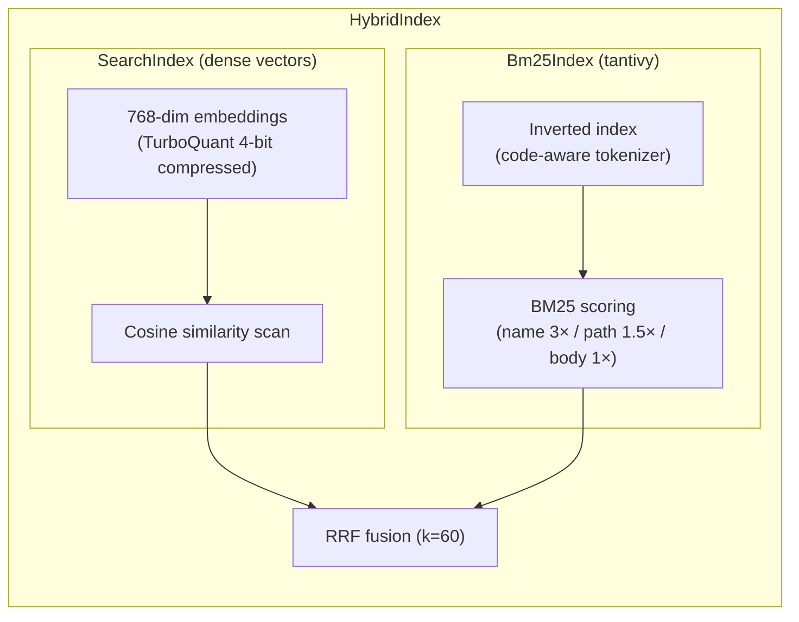
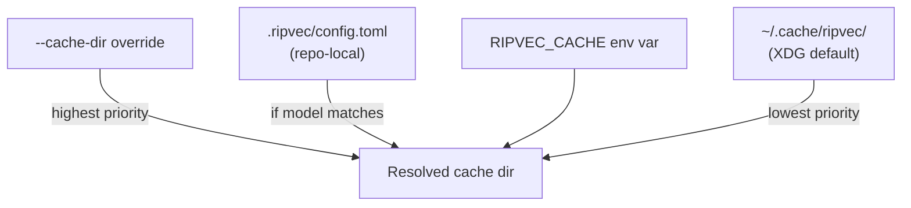
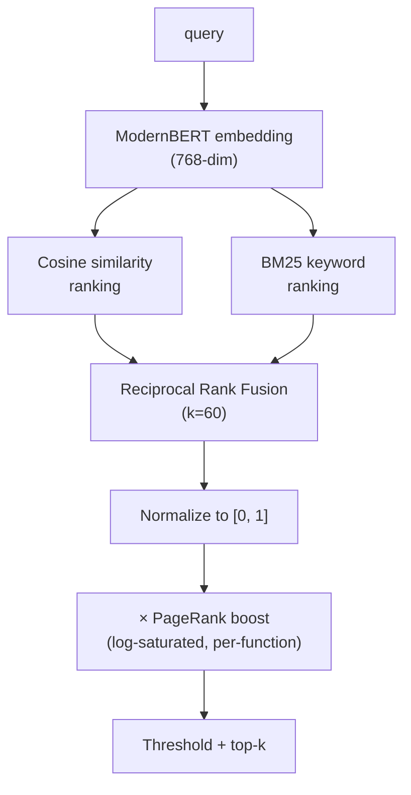
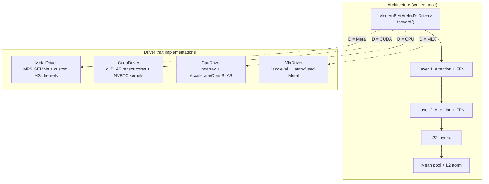
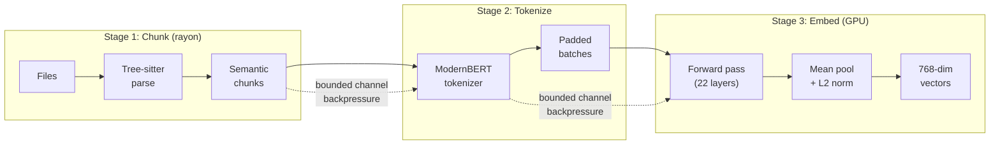

# ripvec

[](https://github.com/fnordpig/ripvec/actions/workflows/ci.yml)
[](https://crates.io/crates/ripvec)
[](LICENSE-MIT)

**Semantic code search + multi-language LSP. One binary, 19 grammars, zero setup.**

ripvec finds code by meaning, provides structural code intelligence across
every language it knows, and ranks results by how important each function is
in your codebase. It runs locally, bundles its own embedding model, and
uses whatever GPU you have.

```sh
$ ripvec "retry logic with exponential backoff" ~/src/my-project

 1. retry_handler.rs:42-78                                        [0.91]
    pub async fn with_retry<F, T>(f: F, max_attempts: u32) -> Result<T>
    where F: Fn() -> Future<Output = Result<T>> {
        let mut delay = Duration::from_millis(100);
        for attempt in 0..max_attempts {
            match f().await {
                Ok(v) => return Ok(v),
                Err(e) if attempt < max_attempts - 1 => {
                    sleep(delay).await;
                    delay *= 2;  // exponential backoff
    ...

 2. http_client.rs:156-189                                        [0.84]
    impl HttpClient {
        async fn request_with_backoff(&self, req: Request) -> Response {
    ...
```

The function is called `with_retry`, the variable is `delay` — "exponential
backoff" appears nowhere in the source. grep can't find this. ripvec can,
because it embeds both your query and the code into the same vector space
and measures similarity.

## When to use what

ripvec has three interfaces. Here's when each one matters:

| Interface | When to use it | Who uses it |
|-----------|---------------|-------------|
| **CLI** (`ripvec "query" .`) | Terminal search, interactive TUI, one-shot queries | You, directly |
| **MCP server** (`ripvec-mcp`) | AI agent needs to search or understand your codebase | Claude Code, Cursor, any MCP client |
| **LSP server** (`ripvec-mcp --lsp`) | Editor/agent needs symbols, definitions, diagnostics | Claude Code's LSP tool, editors |

The MCP server gives AI agents 7 tools (semantic search, repo maps, etc.).
The LSP server gives editors structural intelligence (outlines, go-to-definition,
syntax diagnostics). The CLI is for humans. Same binary for all three.

If you're using **Claude Code**, install the plugin — it sets up both MCP and LSP
automatically. Claude will use `search_code` when you ask conceptual questions
and the LSP for symbol navigation.

## Workflow: orient, search, navigate


**Orient** — `get_repo_map` returns a structural overview ranked by function-level
importance. One tool call replaces 10+ sequential file reads. Start here when
working on unfamiliar code.

**Search** — `search_code "authentication middleware"` finds implementations by
meaning across all 19 languages simultaneously. Results are ranked by relevance
and structural importance.

**Navigate** — LSP `documentSymbol` shows the file outline. `goToDefinition`
jumps to the likely definition. `findReferences` shows usage sites.
`incomingCalls`/`outgoingCalls` traces the call graph.

## Semantic search

You describe behavior, ripvec finds the implementation:

| What you want | grep / ripgrep | ripvec |
|---------------|----------------|--------|
| "retry with backoff" | Nothing (code says `delay *= 2`) | Finds the retry handler |
| "database connection pool" | Comments mentioning "pool" | The pool implementation |
| "authentication middleware" | `// TODO: add auth` | The auth guard |
| "WebSocket lifecycle" | String "WebSocket" | Connect/disconnect handlers |

Search modes: `--mode hybrid` (default, semantic + BM25 fusion), `--mode semantic`
(pure vector similarity), `--mode keyword` (pure BM25). Hybrid is usually best.

## Multi-language LSP

ripvec serves LSP from a single binary for all 19 grammars. No per-language
server installs. It provides:

- **`documentSymbol`** — file outline: functions, fields, enum variants, constants, types, headings
- **`workspaceSymbol`** — cross-language symbol search with PageRank boost
- **`goToDefinition`** — name-based resolution ranked by structural importance
- **`findReferences`** — usage sites via hybrid search + content filtering
- **`hover`** — scope chain, signature, enriched context
- **`publishDiagnostics`** — tree-sitter syntax error detection after every edit
- **`incomingCalls` / `outgoingCalls`** — function-level call graph

For languages with dedicated LSPs (Rust, Python, Go, TypeScript), ripvec runs
alongside them — the dedicated server handles types, ripvec handles semantic
search and cross-language features. For languages without dedicated LSPs
(bash, HCL, Ruby, Kotlin, Swift, Scala), ripvec is the primary code intelligence.

JSON, YAML, TOML, and Markdown get structural outlines (keys, mappings, headings)
and syntax diagnostics — useful for navigating large config files, not comparable
to language-aware intelligence.

## Function-level PageRank



ripvec extracts call expressions from every function body using tree-sitter,
resolves callee names to definitions, and computes PageRank on the resulting
call graph. Functions called by many others rank higher — `authenticate()` in
the example above is more structurally important than `dispatch()` because
more code depends on it.

This directly improves search: when two functions both match your query,
the one that's more central to the codebase ranks first.

## Install

### Pre-built binaries (fastest)

```sh
cargo binstall ripvec ripvec-mcp
```

Requires [cargo-binstall](https://github.com/cargo-bins/cargo-binstall).
Downloads a pre-built binary for your platform — no compilation.

### From source

```sh
cargo install ripvec ripvec-mcp
```

For CUDA (Linux with NVIDIA GPU):

```sh
cargo install ripvec ripvec-mcp --features cuda
```

### Claude Code plugin

```sh
claude plugin install ripvec@fnordpig-my-claude-plugins
```

The plugin auto-downloads the binary for your platform on first use and
configures both MCP and LSP servers. It includes 3 skills (codebase orientation,
semantic discovery, change impact analysis), 3 commands (`/map`, `/find`,
`/repo-index`), and a code exploration agent. CUDA is auto-detected via `nvidia-smi`.

### Platforms

| Platform | Backends | GPU |
|----------|----------|-----|
| macOS Apple Silicon | Metal + MLX + CPU (Accelerate) | Metal auto-enabled |
| Linux x86_64 | CPU (OpenBLAS) | CUDA with `--features cuda` |
| Linux ARM64 (Graviton) | CPU (OpenBLAS) | CUDA with `--features cuda` |

Model weights (~100MB) download automatically on first run.

## Usage

### CLI

```sh
ripvec "error handling" .                    # Search current directory
ripvec "form validation hooks" -n 5          # Top 5 results
ripvec "database migration" --mode keyword   # BM25 only
ripvec "auth flow" --fast                    # Lighter model (BGE-small, 4x faster)
ripvec -i --index .                          # Interactive TUI with persistent index
```

### MCP server

```json
{ "mcpServers": { "ripvec": { "command": "ripvec-mcp" } } }
```

Tools: `search_code`, `search_text`, `find_similar`, `get_repo_map`,
`reindex`, `index_status`, `up_to_date`.

### LSP server

```sh
ripvec-mcp --lsp   # serves LSP over stdio
```

Same binary, `--lsp` flag selects protocol.

## Index architecture

ripvec works without an index (`ripvec "query" .` embeds on-the-fly), but
persistent indexing makes subsequent searches instant.

### Cache layout



Each file's chunks and embeddings are serialized into a `FileCache` object,
compressed with zstd (~8x), and stored by blake3 content hash in a git-style
`xx/hash` sharded object store. The manifest tracks metadata: mtime, size,
content hash, chunk count per file, plus Merkle directory hashes.

### Change detection — two-level diff



Level 1 (mtime+size) is a stat call — microseconds. Level 2 (blake3 hash)
reads the file but avoids re-embedding if content hasn't changed. After
`git clone` (where all mtimes are wrong), the first run hashes everything
but re-embeds nothing — then heals the manifest mtimes for fast-path on
subsequent runs.

### Serialization — two formats

| Format | Used for | Portable? |
|--------|----------|-----------|
| **rkyv** (zero-copy) | User-level cache (~/.cache) | No (architecture-dependent) |
| **bitcode** | Repo-level cache (.ripvec/) | Yes (cross-architecture) |

Auto-detected on read via magic bytes: `0x42 0x43` = bitcode, otherwise rkyv.
Both are zstd-compressed. Repo-level indices use bitcode so they can be
committed to git and shared between x86 CI and ARM developer machines.

### Concurrency and locking



The file watcher debounces for 2 seconds of quiet before triggering
re-indexing. Advisory `fd-lock` on `manifest.lock` prevents readers from
seeing a half-written manifest. The MCP server holds a read lock during
queries; the watcher holds a write lock during index updates. Multiple
readers can proceed concurrently; writers block all readers.

Garbage collection runs after each incremental update — unreferenced objects
(from deleted or re-embedded files) are removed from the store.

### Dual search index



The BM25 index uses a code-aware tokenizer that splits `parseJsonConfig` into
`[parse, json, config]` and `my_func_name` into `[my, func, name]` — so keyword
search finds `json config parser` even if the function is named in camelCase.
Function names are boosted 3x over body text.

TurboQuant compresses 768-dim vectors from 3KB to ~380 bytes (4-bit) with a
rotation matrix for better quantization. This enables ~5x faster scanning for
large indices while maintaining ranking quality through exact re-ranking of
the top candidates.

### Repo-level indexing

```sh
ripvec --index --repo-level "query"
git add .ripvec/ && git commit -m "add search index"
```

Creates `.ripvec/config.toml` (pins model + version) and `.ripvec/cache/`
(manifest + objects). Teammates who clone get instant search. The config
is validated on load — if the model doesn't match the runtime model, ripvec
falls back to the user-level cache with a warning.

### Cache resolution



## Supported languages

19 tree-sitter grammars, 30 file extensions:

| Language | Extensions | Extracted elements |
|----------|-----------|-------------------|
| Rust | `.rs` | functions, structs, enums, variants, fields, impls, traits, consts, mods |
| Python | `.py` | functions, classes, assignments |
| JavaScript | `.js` `.jsx` | functions, classes, methods, variables |
| TypeScript | `.ts` `.tsx` | functions, classes, interfaces, type aliases, enums |
| Go | `.go` | functions, methods, types, constants |
| Java | `.java` | methods, classes, interfaces, enums, fields, constructors |
| C | `.c` `.h` | functions, structs, enums, typedefs |
| C++ | `.cpp` `.cc` `.cxx` `.hpp` | functions, classes, namespaces, enums, fields |
| Bash | `.sh` `.bash` `.bats` | functions, variables |
| Ruby | `.rb` | methods, classes, modules, constants |
| HCL / Terraform | `.tf` `.tfvars` `.hcl` | blocks (resources, data, variables) |
| Kotlin | `.kt` `.kts` | functions, classes, objects, properties |
| Swift | `.swift` | functions, classes, protocols, properties |
| Scala | `.scala` | functions, classes, traits, objects, vals, types |
| TOML | `.toml` | tables, key-value pairs |
| JSON | `.json` | object keys |
| YAML | `.yaml` `.yml` | mapping keys |
| Markdown | `.md` | headings |

Unsupported file types get sliding-window plain-text chunking. The embedding
model handles any language — tree-sitter just provides better chunk boundaries.

## Performance

**Without an index** (first run on a codebase):

| Hardware | Throughput | Time (Flask corpus, 2383 chunks) |
|----------|-----------|----------------------------------|
| RTX 4090 (CUDA) | 435 chunks/s | ~5s |
| M2 Max (Metal) | 73.8 chunks/s | ~32s |
| M2 Max (CPU/Accelerate) | 73.5 chunks/s | ~32s |

Metal and CPU show similar throughput on M2 Max because macOS Accelerate
routes BLAS operations through the AMX coprocessor regardless of backend.
The Metal backend has headroom on larger batches and non-BLAS operations.

**With an index**: milliseconds. Merkle diff skips unchanged files entirely.

**Memory**: ~500MB during embedding (model weights + batch buffers). Index
queries use ~100MB (loaded embeddings + BM25 inverted index).

## How it compares

| Tool | Type | Key difference from ripvec |
|------|------|--------------------------|
| ripgrep | Text search | No semantic understanding |
| Sourcegraph | Cloud AI platform | $49-59/user/month, code leaves your machine |
| grepai | Local semantic search | Requires Ollama for embeddings |
| mgrep | Semantic search | Uses cloud embeddings (Mixedbread AI) |
| Serena | MCP symbol navigation | Requires per-language LSP servers installed |
| Bloop | Was semantic + navigation | Archived Jan 2025 |
| VS Code anycode | Tree-sitter outlines | Editor-only, no cross-file search |
| Cursor @Codebase | IDE semantic search | Cursor-only, sends embeddings to cloud |

ripvec is self-contained (no Ollama, no cloud, no per-language setup), runs
on your GPU, and combines search + LSP + structural ranking in one binary.

## Scoring pipeline



The RRF fusion follows Cormack et al. (2009) — rank-based combination that
handles the scale mismatch between cosine similarity and BM25 without tuning.
The PageRank boost is multiplicative: zero-relevance stays at zero regardless
of structural importance.

Min-max normalization maps the best result to 1.0 within each query, making
the threshold relative rather than absolute. This is a known tradeoff; future
versions may switch to z-score normalization for better calibration.

## Limitations

- **goToDefinition is best-effort**: resolves by name matching and structural
  importance, not by type system analysis. Use dedicated LSPs (rust-analyzer,
  pyright, gopls) when you need exact resolution for overloaded symbols.
- **Call graph is approximate**: common names like `new`, `run`, `render` may
  resolve to the wrong definition. Cross-crate resolution limited to workspace
  members.
- **Cold start**: first search without an index embeds everything — 5s on CUDA,
  32s on Apple Silicon for a medium codebase. Use `--index` for repeated searches.
- **English-centric**: ModernBERT was trained primarily on English text. Queries
  and code comments in other languages will have lower recall.

## Architecture

Cargo workspace with three crates:

| Crate | Role |
|-------|------|
| [`ripvec-core`](crates/ripvec-core) | Backends, chunking, embedding, search, repo map, cache, call graph |
| [`ripvec`](crates/ripvec) | CLI binary (clap + ratatui TUI) |
| [`ripvec-mcp`](crates/ripvec-mcp) | MCP + LSP server binary (rmcp + tower-lsp-server) |

### Driver / Architecture split

The core design insight: the forward pass is written ONCE as a generic
`ModernBertArch<D: Driver>`, and each backend implements the `Driver` trait
with platform-specific operations. Same model, same math, different hardware.



### What each backend actually does per layer

Each of the 22 ModernBERT layers runs attention + FFN. Here's how the same
operations map to different hardware:

```mermaid
graph LR
    subgraph "Attention"
        LN1["LayerNorm"] --> QKV["QKV projection<br/>(GEMM)"]
        QKV --> PAD["Pad + Split"]
        PAD --> ROPE["RoPE rotation"]
        ROPE --> ATTN["Q @ K^T<br/>(batched GEMM)"]
        ATTN --> SM["Scale + Mask<br/>+ Softmax"]
        SM --> AV["Scores @ V<br/>(batched GEMM)"]
        AV --> UNPAD["Reshape + Unpad"]
        UNPAD --> OPROJ["Output proj<br/>(GEMM)"]
        OPROJ --> RES1["Residual add"]
    end
    subgraph "FFN"
        RES1 --> LN2["LayerNorm"]
        LN2 --> WI["Wi projection<br/>(GEMM)"]
        WI --> GEGLU["Split + GeGLU"]
        GEGLU --> WO["Wo projection<br/>(GEMM)"]
        WO --> RES2["Residual add"]
    end
```



| Operation | Metal | CUDA | CPU | MLX |
|-----------|-------|------|-----|-----|
| **GEMM** | MPS (AMX) | cuBLAS FP16 tensor cores | Accelerate / OpenBLAS | Auto-fused |
| **Softmax+Scale+Mask** | Fused MSL kernel | Fused NVRTC kernel | Scalar loop | Auto-fused |
| **RoPE** | Custom MSL kernel | Custom NVRTC kernel | Scalar loop | Lazy ops |
| **GeGLU (split+gelu+gate)** | Fused MSL kernel | Fused NVRTC kernel | Scalar loop | Auto-fused |
| **Pad/Unpad/Reshape** | Custom MSL kernels | Custom NVRTC kernels | Rust loops | Free (metadata) |
| **FP16 support** | Yes (all kernels) | Yes (all kernels) | No | No |

Metal and CUDA have **hand-written fused kernels** for softmax, GeGLU, and
attention reshape — these eliminate intermediate buffers and reduce memory
bandwidth. MLX gets fusion automatically via lazy evaluation (the entire
forward pass typically compiles to 2-3 Metal kernel dispatches). CPU uses
explicit scalar loops for everything except GEMM.

### Embedding pipeline



For large corpora (1000+ files), stages run concurrently as a streaming
pipeline with bounded channels for backpressure. The GPU starts embedding
after the first batch (~50ms), not after all files are chunked.

### Embedding models

- **ModernBERT** (default) — 768-dim, mean pooling, 22 layers
- **BGE-small** (`--fast`) — 384-dim, CLS pooling, 12 layers

## Development

```sh
cargo fmt --check && cargo clippy --all-targets -- -D warnings && cargo test --workspace
```

See [CLAUDE.md](CLAUDE.md) for detailed development conventions, architecture
notes, and MCP tool namespace resolution.

### Docs

- [Metal/MPS Architecture](docs/METAL_MPS_ARCHITECTURE.md)
- [CUDA Architecture](docs/CUDA_ARCHITECTURE.md)
- [Development Learnings](docs/LEARNINGS.md)

## License

Licensed under either of [Apache-2.0](LICENSE-APACHE) or [MIT](LICENSE-MIT) at your option.
