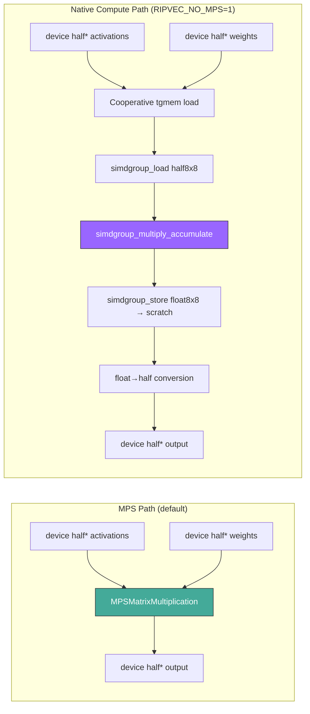
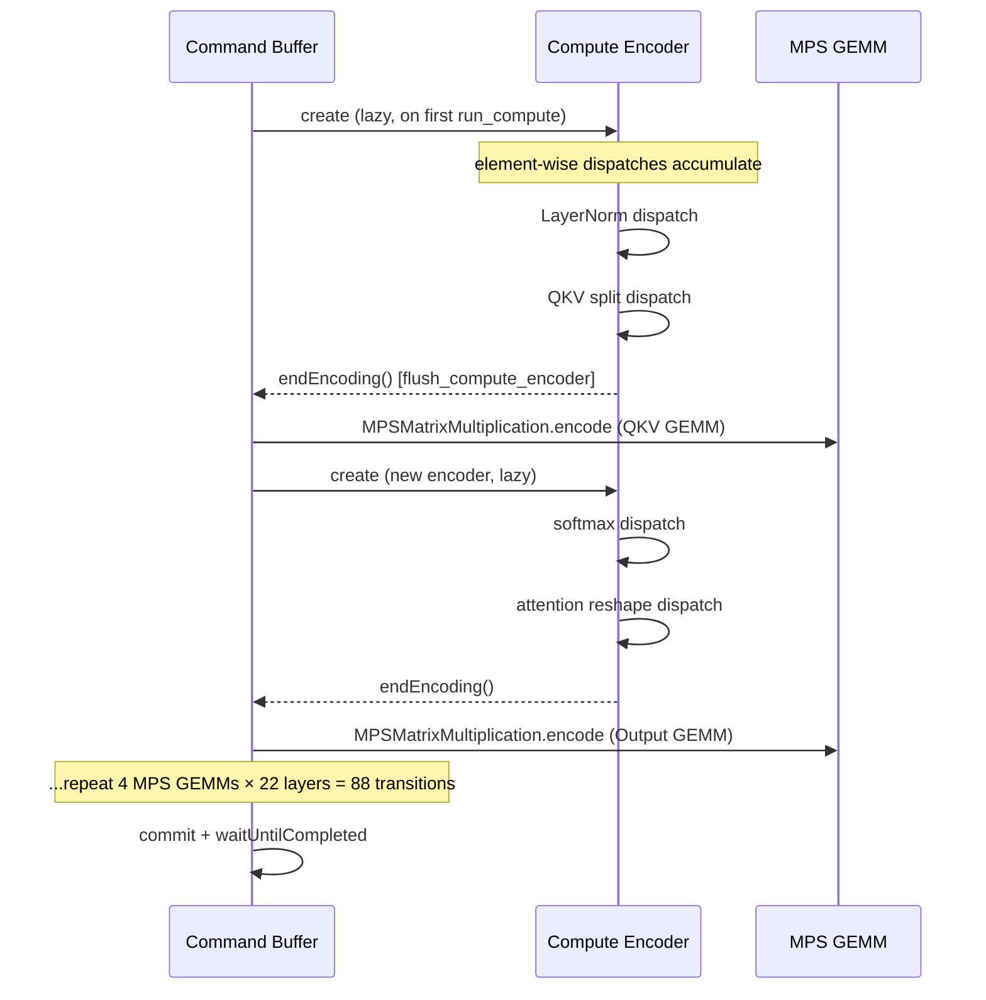

# Metal/MPS Architecture Guide

> Internal reference for developers working on ripvec's Apple Silicon GPU backend.
> Covers the dual GEMM architecture (MPS vs native compute), non-obvious design decisions,
> environment variable controls, and profiling instrumentation.

---

## Table of Contents

1. [Overview](#overview)
2. [Two GEMM Architectures](#two-gemm-architectures)
3. [MPS Path (Production Default)](#mps-path-production-default)
4. [Native Compute Path](#native-compute-path)
5. [INT8 Quantization Path](#int8-quantization-path)
6. [Non-Obvious Design Decisions](#non-obvious-design-decisions)
7. [Environment Variables](#environment-variables)
8. [Debug Labels & Profiling Instrumentation](#debug-labels--profiling-instrumentation)
9. [Appendix: Key Constants](#appendix-key-constants)

---

## Overview

ripvec's Metal backend runs ModernBERT (22 layers, 768-dim, alternating local/global attention) on Apple Silicon GPUs. The forward pass uses a Driver/Architecture split:

- **`ModernBertArch<MetalTensor>`** (arch) — model-agnostic forward pass calling Driver primitives
- **`MetalDriver`** (driver) — Metal-specific implementations of GEMM, LayerNorm, softmax, etc.

Each forward pass processes a batch of tokenized chunks through all 22 layers, producing one L2-normalized 768-dim embedding per chunk.

### Data Flow

```mermaid
graph TD
    subgraph "Forward Pass (per batch)"
        A[Tokenized chunks] --> B[Embedding lookup + LayerNorm]
        B --> C{use_f16?}

        C -->|true| D[f32_to_f16 conversion]
        D --> E[22 FP16 Layers]
        E --> F[f16_to_f32 conversion]

        C -->|false| G[22 FP32 Layers]

        F --> H[Final LayerNorm]
        G --> H
        H --> I[Mean Pool + L2 Normalize]
        I --> J[768-dim embedding]
    end

    subgraph "Per Layer (FP16 path shown)"
        E --> L1[Pre-attention LayerNorm]
        L1 --> L2[QKV GEMM ★]
        L2 --> L3[Pad to batch + QKV split + RoPE]
        L3 --> L4[Q@K^T batched GEMM]
        L4 --> L5[Softmax + mask]
        L5 --> L6[Scores@V batched GEMM]
        L6 --> L7[Reshape + Unpad]
        L7 --> L8[Output GEMM ★]
        L8 --> L9[Residual add]
        L9 --> L10[FFN LayerNorm]
        L10 --> L11[Wi GEMM ★]
        L11 --> L12[GeGLU activation]
        L12 --> L13[Wo GEMM ★]
        L13 --> L14[Residual add]
    end

    style L2 fill:#f96,stroke:#333
    style L8 fill:#f96,stroke:#333
    style L11 fill:#f96,stroke:#333
    style L13 fill:#f96,stroke:#333
```

The ★ operations are weight GEMMs — the dominant cost and the focus of optimization.

---

## Two GEMM Architectures



### Why Two Paths?

**MPS** uses Apple's proprietary AMX coprocessor for matrix multiplication — undocumented hardware unavailable to compute shaders. MPS achieves ~73.8/s at 22 layers.

**Native compute** uses standard `simdgroup_multiply_accumulate` on the GPU's ALU. It eliminates MPS encoder transitions (88 per forward pass, ~7% overhead) but is 26% slower per-FLOP. Achieves ~59.4/s at 22 layers.

The native path exists to:
1. Enable INT8 quantization (MPS can't dequantize custom formats)
2. Provide a foundation for fused GEMM+activation kernels
3. Eliminate MPS encoder transition overhead (significant for future >22 layer models)

---

## MPS Path (Production Default)

### Encoder Lifecycle



Each MPS GEMM requires closing the compute encoder, dispatching MPS, then lazily creating a new compute encoder for the next element-wise operation. This costs ~0.8ms per transition × 88 = ~70ms per forward pass.

### Pool Buffer System

```
begin_batch():
  pool_cursor = 0          ← reset FP32 cursor
  pool_f16_cursor = 0      ← reset FP16 cursor

Per layer:
  saved = save_pool_cursor()   ← snapshot both cursors
  alloc_zeros_f16(n) → pool_f16[cursor++]
  ...layer compute...
  restore_pool_cursor(saved)   ← recycle transient tensors
                                  (hidden_states survives — allocated before save)

end_batch():
  commit command buffer
  waitUntilCompleted
  check GPU errors
```

**Critical invariant**: `hidden_states` must be allocated BEFORE `save_pool_cursor()`. The restore reclaims everything allocated after the save point.

### Weight Pre-Conversion

At model load time, `ensure_fp16()` converts each FP32 weight tensor to FP16 on the GPU:

```rust
tensor.fp16 = Some(fp16_buffer);  // stored in MetalTensor.fp16 RefCell
```

`gemm_f16()` checks this field and passes the FP16 buffer to MPS with `MPSDataType::Float16`. This halves weight memory bandwidth.

---

## Native Compute Path

### Kernel Architecture (llama.cpp-derived)

```
gemm_f16w_f32a_kernel
├── Tile: BM=64, BN=64, BK=32
├── Threadgroup: 128 threads (4 simdgroups × 32 threads)
├── Output per simdgroup: 32×32 (16 accumulators of 8×8)
│
├── Threadgroup Memory (8KB total)
│   ├── sa[2048 halfs] — activations, 8×8-block layout
│   └── sb[2048 halfs] — weights, 8×8-block layout
│
├── Cooperative Load (128 threads, NL=2)
│   ├── 64 rows × 2 threads/row × 16 elements/thread = 2048 elements
│   ├── Block addressing: ib = 8 * K_blk + M_blk (or N_blk)
│   └── Within block: stride 8, simdgroup_load reads optimally
│
├── Compute Loop (K/32 iterations)
│   ├── simdgroup_load(half8x8, tgmem, stride=8)  ← hardware instruction
│   ├── simdgroup_multiply_accumulate(float, half, half, float)  ← native MAC
│   └── simdgroup_barrier(mem_flags::mem_none) between phases
│
└── Fused Store (per-tile, no cross-simdgroup barriers)
    ├── simdgroup_store(float8x8, scratch, stride=8)
    └── 32 threads: scratch[float] → C_batch[half] conversion
```

### 8×8-Block Memory Layout

Standard row-major would scatter simdgroup loads across cache lines. The 8×8-block layout makes each `simdgroup_load` read 64 contiguous halfs:

```
Block ib=0:  sa[0..63]    = 8×8 tile at (K_blk=0, M_blk=0)
Block ib=1:  sa[64..127]  = 8×8 tile at (K_blk=0, M_blk=1)
...
Block ib=8:  sa[512..575] = 8×8 tile at (K_blk=1, M_blk=0)
```

Within each block: `sa[64*ib + 8*row + col]` where row and col are 0..7.

### Why NL=2, Not NL=4

128 threads must load a 64×32 tile (64 rows × 32 K-elements). With NL=4, `lr = tiitg/4` gives only 0..31 — half the rows. Simdgroups accessing rows 32-63 read uninitialized threadgroup memory.

**NL=2**: `lr = tiitg/2` gives 0..63. Each thread loads 16 elements (`il = tiitg%2`, offset `16*il + i` for i=0..15). This covers all 64 rows × 32 elements = 2048 elements total.

### Multiply Order: ma × mb = [M,N]

The tgmem layout stores:
- `sa`: M-rows, K-cols → `simdgroup_load` gives `ma[M, K]`
- `sb`: K-rows, N-cols → `simdgroup_load` gives `mb[K, N]`

Multiply: `mc += ma[i/4] × mb[i%4]` = `[M,K] × [K,N]` = `[M,N]` (row-major).

This produces row-major output directly — no transposed store needed for the `simdgroup_store(float8x8)` to scratch. The scratch-to-device conversion writes `C[gm * N + gn]` in row-major order.

---

## INT8 Quantization Path

### block_q8_0 Format (llama.cpp Compatible)

```
struct block_q8_0 {    // 34 bytes
    half d;            // scale factor for this 32-element block
    int8_t qs[32];     // quantized values: original ≈ qs[i] × d
};
```

Each row of the weight matrix has `K/32` blocks. ModernBERT with K=768: 24 blocks per row.

**Per-row quantization (1 scale per 768 elements) is too coarse** — outliers crush dynamic range. Per-32-element blocks adapt to local value range, achieving <0.02 score difference vs FP16.

### Dequantization During Cooperative Load

```metal
uint k_pos = loop_k + 16 * il1 + i;
device block_q8_0* blk = y_row + k_pos / 32;
half val = half(float(blk->qs[k_pos % 32]) * float(blk->d));
*(sb + 64 * ib + 8 * lx_k + ly_n) = val;
```

After dequantization, the tgmem layout and compute loop are identical to the FP16 kernel. The only difference is the B cooperative load.

### Memory Savings

| Format | Weight size (ModernBERT) | Ratio |
|--------|-------------------------|-------|
| FP32 | 568 MB | 1.0× |
| FP16 | 284 MB | 0.5× |
| INT8 (block_q8_0) | 149 MB | 0.26× |

Model load time improves proportionally. Resident memory footprint matters for a CLI tool.

---

## Non-Obvious Design Decisions

### 1. Pipeline State `device float*` Workaround

**Problem**: Declaring `device half*` buffer arguments in a Metal kernel's function signature causes a 20× throughput regression on ALL GPU workloads globally — including MPS-backed operations that don't use the kernel.

**Root cause**: Metal driver bug. The pipeline state's argument buffer descriptor triggers a different (slower) GPU scheduling strategy when half-precision buffer types are present.

**Workaround**: All native kernel buffer arguments are declared as `device float*`. Inside the kernel body, they're cast: `device half* A = (device half*)A_raw;`. This keeps the pipeline state's argument table as float pointers while the kernel operates on half data.

**Verification**: Benchmark MPS throughput before and after adding any new kernel. Must match within 5%.

### 2. Separate Metal Library for Native Kernels

The MSL compiler optimizes all kernels in a compilation unit together. Complex native simdgroup code (using `simdgroup_half8x8`, `simdgroup_float8x8`, `simdgroup_multiply_accumulate`) in the same library as simpler element-wise kernels can degrade code generation for the simpler kernels.

```rust
let library = compile_library(device, KERNELS)?;           // element-wise
let gemm_library = compile_library(device, GEMM_KERNEL)?;   // MFA GEMM
let native_gemm_library = compile_library(device, NATIVE_GEMM_KERNEL)?;  // native simdgroup
```

Three separate compilation units isolate compiler effects.

### 3. FP16 Activations Are Not a Compute Win

Apple Silicon's `simdgroup_multiply_accumulate` runs at the **same clock speed** for `half × half → float` and `float × float → float`. FP16 activations provide zero compute throughput advantage.

FP16 helps only with **memory bandwidth** for element-wise ops (2× less data per read/write). At 768-dim, the element-wise ops are a small fraction of total time — the bandwidth saving is marginal.

The FP16 forward path exists because MPS's FP16 GEMM is faster than MPS's FP32 GEMM (MPS accesses AMX differently for FP16). Not because FP16 compute is faster on the ALU.

### 4. Encoder Segmentation Is Unnecessary

The Metal compute encoder handles 400+ dispatches in a single encoder without overflow, timeout, or degradation. There is no documented or empirical dispatch limit.

`segment_encoder()` (close + reopen the encoder within the same command buffer) was initially added as a workaround for GPU "hangs" at ≥15 layers. Testing proved the hangs were caused by:
- `segment_encoder()` overhead: ~118ms per call × 22 layers = 2.6s of pure overhead
- Test timeouts expiring before the slow forward pass completed

After removing all segmentation, 22 layers completes at 31/s (compute path) with zero hangs.

### 5. MPS Wins Because of AMX, Not Better Algorithms

MPS's `MPSMatrixMultiplication` accesses the AMX (Apple Matrix coprocessor) — dedicated matrix multiplication hardware that is unavailable to Metal compute shaders. This is why:

- MPS FP16: **73.8/s** (AMX hardware)
- Native compute FP16: **59.4/s** (GPU ALU via simdgroup MACs)
- CPU Accelerate BLAS: **73.5/s** (also AMX, via the CPU side)

The native compute kernel at 47/s has **95%+ GPU utilization** and **0.5% driver overhead**. The gap is pure per-FLOP throughput, not scheduling or overhead. Custom kernels cannot match MPS on Apple Silicon for dense matrix multiplication.

### 6. FP32 Device Reads Are the Bandwidth Bottleneck

At batch=32 with ModernBERT, the activation matrix has M=35,762 rows × K=768 columns:
- FP32: 35,762 × 768 × 4 bytes = **110 MB**
- FP16: 35,762 × 768 × 2 bytes = **55 MB**

The cooperative tgmem load reads scattered 4-8KB tiles across this buffer. L2 cache on M2 Max is ~48MB — cannot hold the full activation matrix. Each cache miss fetches from DRAM at ~400 GB/s.

FP32 activations cause 2× the cache pressure and DRAM fetches vs FP16. This is why the FP32 activation path (34/s) is dramatically slower than FP16 (47/s), even though the compute is identical.

---

## Environment Variables

| Variable | Values | Effect | Scope |
|----------|--------|--------|-------|
| `RIPVEC_NO_MPS` | `1` | Forces FP32 forward path + native compute GEMM. **Known broken**: `gemm()` passes float* to half* kernel. Only the `gemm_f16()` dispatch works correctly. | Forward pass + GEMM dispatch |
| `RIPVEC_Q8` | `1` | Quantizes weights to block_q8_0 at model load. All weight GEMMs route through INT8 kernel. | Weight loading + GEMM dispatch |
| `RIPVEC_FP32` | `1` | Forces FP32 forward path but keeps MPS for GEMMs. Useful for isolating FP16 vs FP32 activation effects. | Forward pass only |
| `RIPVEC_CACHE` | path | Override persistent index cache directory. | Cache system |
| `RIPVEC_ROOT` | path | Override project root for MCP server. | MCP server |

### Interaction Matrix

| | Default | `NO_MPS=1` | `Q8=1` | `FP32=1` |
|---|---|---|---|---|
| **Forward path** | FP16 | FP32 | FP16 | FP32 |
| **Weight GEMMs** | MPS FP16 | Native compute (broken in gemm()) | INT8 block_q8_0 | MPS FP32 |
| **Attention GEMMs** | MPS batched FP16 | MPS batched FP16 | MPS batched FP16 | MPS batched FP32 |
| **Element-wise** | FP16 kernels | FP32 kernels | FP16 kernels | FP32 kernels |
| **Throughput (22L)** | **73.8/s** | ~59.4/s | **35/s** | **54/s** |

---

## Debug Labels & Profiling Instrumentation

### Command Buffer Labels

```rust
cmd.setLabel(Some(ns_string!("forward-pass")));  // in begin_batch()
```

Appears in Metal System Trace as the command buffer name, replacing generic "Command Buffer 0".

### Compute Encoder Debug Groups

Every `run_compute` call wraps the dispatch in a debug group:

```rust
fn run_compute<F>(&self, label: &str, f: F) -> crate::Result<()> {
    // ...
    enc.pushDebugGroup(&ns_label);
    let result = f(enc);
    enc.popDebugGroup();
    // ...
}
```

Labels visible in Xcode Instruments encoder timeline:
- `"embedding-lookup"`, `"layer-norm"`, `"softmax"`, `"gelu"`, etc.
- `"gemm-fused-f16"` — native compute GEMM dispatch
- `"gemm-q8w-f16a"` — INT8 GEMM dispatch
- `"mps-gemm"`, `"mps-gemm-f16"` — MPS GEMM dispatches
- `"f32-to-f16"`, `"f16-to-f32"` — precision conversions

### Command Queue Label

```rust
queue.setLabel(Some(ns_string!("ripvec-compute")));
```

Identifies ripvec's work in system-wide GPU traces.

### Recording Traces

```bash
# MPS path (exports correctly)
xcrun xctrace record \
  --template 'Metal System Trace' \
  --output /tmp/trace.trace \
  --time-limit 15s \
  --no-prompt \
  --target-stdout /dev/null \
  --launch -- ./target/release/ripvec "test" -n 1 . --profile

# Compute path (must use --env, short captures only)
xcrun xctrace record \
  --template 'Metal System Trace' \
  --output /tmp/trace_compute.trace \
  --time-limit 8s \
  --no-prompt \
  --env RIPVEC_NO_MPS=1 \
  --target-stdout /dev/null \
  --launch -- ./target/release/ripvec "test" -n 1 . --mode semantic -T 0.0
```

**Key constraints:**
- `--env` is required for environment variables (parent shell env NOT propagated)
- Use ripvec's own code (`.`) for short captures — Flask at 22 layers produces 8GB+ traces
- The `--layers` flag has been removed; all 22 layers always run
- Compute-only traces may fail to export on large captures ("Document Missing Template Error")

### tracemeld Integration

```
import_profile(source: "/tmp/trace.trace", format: "xctrace")
profile_summary(group_by: "lane")
bottleneck(dimension: "wall_ms", top_n: 5)
save_baseline(name: "before-change", checkpoint: "before", task: "description")
# ...make changes, record new trace...
diff_profile(baseline: "before-change", dimension: "wall_ms")
```

### Profile Metrics Cheat Sheet

| Metric | MPS healthy | Compute healthy | Problem if |
|--------|-------------|-----------------|-----------|
| gpu-compute % | 89-95% | 95-98% | <80% |
| driver % | 2-3% | 0.5-1% | >5% |
| gpu idle % | 7-10% | 3-6% | >15% |
| Top GEMM span | 60-80ms | 100-130ms | >200ms |
| Compute spans | ~3500 | ~1600 | >5000 |

---

## Appendix: Key Constants

### Tile Dimensions

| Constant | Value | Used in |
|----------|-------|---------|
| BM (M tile) | 64 | All tiled GEMM kernels |
| BN (N tile) | 64 | All tiled GEMM kernels |
| BK (K tile) | 32 | Matches block_q8_0 block size |
| Simdgroups | 4 | 128 threads per threadgroup |
| Accumulators/SG | 16 | 4×4 of 8×8 tiles = 32×32 output |

### ModernBERT Dimensions

| Dimension | Value | GEMM shapes |
|-----------|-------|-------------|
| hidden | 768 | QKV: [M, 768] × [2304, 768]^T |
| intermediate | 1152 | Wi: [M, 768] × [2304, 768]^T |
| num_heads | 12 | head_dim = 64 |
| num_layers | 22 | 8 global + 14 local attention |
| local_window | 128 | For local attention layers |
| vocab_size | 50368 | Embedding table |

### MAX_BATCH and Token Counts

| Parameter | Value | Notes |
|-----------|-------|-------|
| MAX_BATCH | 32 | Chunks per forward pass |
| Typical total_tokens | 3,000-36,000 | Depends on chunk lengths |
| max_seq (padded) | varies | `max(seq_lengths).next_multiple_of(8)` |
| Attention matrix | [batch×heads, max_seq, max_seq] | Padded for attention only |
